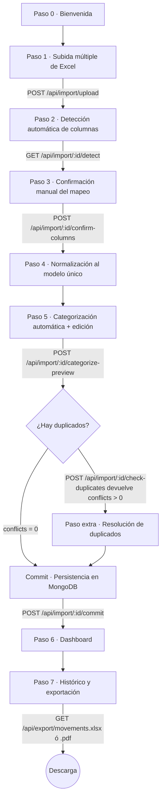
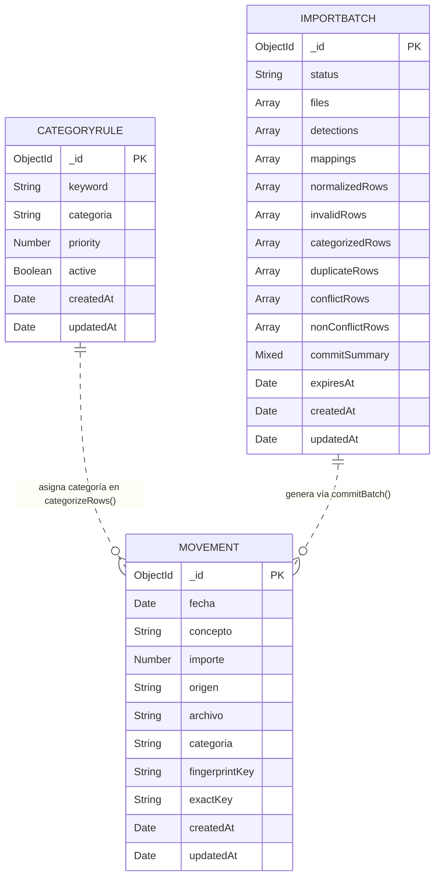

# Arquitectura — SaveMyMoneyNow

Documento técnico que acompaña al `README.md`. Cubre los diagramas de flujo y de datos, el funcionamiento interno de la heurística de detección de columnas en Excel, la regla de duplicados y los puntos de extensión más habituales.

---

## 1. Diagrama de flujo del wizard

El asistente avanza de forma lineal salvo en el paso de duplicados, que solo se renderiza si la comprobación contra Mongo encuentra conflictos. La bifurcación se muestra explícitamente.



Notas:

- Los pasos 0 a 4 trabajan únicamente contra el `ImportBatch` (material temporal, TTL 2 días).
- El paso 6 (commit) es el único momento en que se escriben documentos `Movement` definitivos.
- El dashboard y el histórico ya no dependen del lote: consultan `Movement` directamente.

---

## 2. Diagrama ER de Mongo

Tres colecciones independientes. No hay referencias por `ObjectId` entre ellas: `ImportBatch` mantiene los movimientos del lote como subdocumentos embebidos (`categorizedRows`, `normalizedRows`, etc.) para que el lote sea autocontenido y la lectura del wizard sea una sola query.



Notas sobre relaciones:

- `CategoryRule → Movement` es una relación **lógica** (no de FK): durante `categorizeRows()` el servicio recorre las reglas y asigna `categoria` al movimiento. Tras el commit, el `Movement` lleva la categoría como string plano: si se elimina la regla, el movimiento conserva su categoría histórica.
- `ImportBatch → Movement` también es lógica: el lote contiene las filas que van a convertirse en movimientos al hacer commit. Tras el commit, no se guarda la relación: el `Movement` es independiente y el `ImportBatch` se elimina por TTL.
- Índices clave: `fingerprintKey` (búsqueda de duplicados), `fecha` (filtros temporales del dashboard), `categoria` y `origen` (filtros del histórico).

---

## 3. Heurística de detección de columnas en Excel

Cada banco entrega su extracto con cabeceras distintas, filas de metadatos al principio y, a veces, sin cabeceras claras. La detección se hace en `backend/src/services/ExcelDetection.service.js` en dos fases.

### Fase 1 — Detección de la fila de cabecera

Cada fila del Excel se puntúa según cuántos de los cuatro tipos de columna (`fecha`, `concepto`, `importe`, `saldo`) aparecen en su texto. Se concatena toda la fila a un único string para que coincidan también expresiones compuestas como "Fecha operación".

```
score(row) = Σ tipo ∈ {fecha, concepto, importe, saldo} :
             1 si alguna keyword del diccionario HEADER_SYNONYMS[tipo]
             está contenida en normalizeText(row)
             0 en caso contrario

→ headerRow = argmax(score(row))
  si max(score) >= 2; en caso contrario headerRow = 0
```

El umbral de 2 evita falsos positivos: una fila aleatoria con la palabra "fecha" suelta no califica como cabecera. Si nada llega a 2, se asume `headerRow = 0` y el usuario corrige a mano en el paso 3.

### Fase 2 — Asignación de cada columna

Una vez localizada la fila cabecera, cada columna candidata se puntúa para cada tipo combinando dos fuentes:

#### Scoring por nombre de cabecera (`headerHeuristicScore`)

| Condición sobre la cabecera normalizada | Score |
| --- | --- |
| Coincidencia exacta con una keyword del diccionario | **+8** |
| Coincidencia parcial (`includes`) con una keyword | **+5** |
| Para `concepto`: incluye `"fecha"` | **-7** |
| Para `concepto`: incluye `"saldo"` | **-4** |
| Para `concepto`: incluye `"importe"` | **-4** |
| Para `fecha`: incluye `"descripcion"` | **-4** |
| Para `importe`: incluye `"saldo"` | **-2** |

#### Scoring por contenido (`valueHeuristicScore`)

Se mira solo los primeros 25 valores de la columna (rendimiento):

| Tipo | Cálculo | Score máximo |
| --- | --- | --- |
| `fecha` | `(valores parseables con parseDateValue / total) * 8` | 8 |
| `importe` / `saldo` | `(valores parseables con parseAmountValue / total) * 8` | 8 |
| `concepto` | `(valores no-fecha y no-importe / total) * 8` | 8 |

#### Selección final

Los tipos se asignan en orden de prioridad **fecha → importe → concepto → saldo**: empezando por los más disambiguables (fecha parsea como `Date`, importe como `Number`) y dejando `concepto` para el final (todo lo que sobra como texto). Se elige el índice de columna con mayor score combinado, con la restricción de que cada columna solo se puede asignar a un tipo (`usedIndexes`). Si el mejor score no supera 1, el campo queda vacío y el usuario lo asigna a mano.

### Tabla resumen del scoring combinado

| Columna candidata | Header score | Value score | Total | ¿Gana? |
| --- | --- | --- | --- | --- |
| "Fecha operación" con fechas válidas | +8 (parcial × 1.6) | +8 | ~16 | Sí, para `fecha` |
| "Concepto" con texto | +8 | +8 | 16 | Sí, para `concepto` |
| "Importe" con números | +8 | +8 | 16 | Sí, para `importe` |
| "Saldo" con números | +8 | +8 | 16 | Sí, para `saldo` |
| Columna `Col1` sin nombre, con fechas | 0 | +8 | 8 | Sí si no hay mejor candidato |
| "Fecha movimiento" para `concepto` | -7 | bajo | negativo | No (penalización) |

---

## 4. Regla de duplicados

La comparación entre lote entrante y BBDD se hace en `backend/src/services/Duplicate.service.js`. La huella usada es `fingerprintKey = fecha|concepto` (sin importe). El importe entra solo en la decisión de la acción por defecto.

### Tabla de verdad

| Existe `fingerprintKey` en BBDD | ¿Algún existing tiene mismo importe que la nueva fila? | Resultado | `defaultAction` |
| --- | --- | --- | --- |
| No | — | Inserción limpia (sin conflicto) | — (va a `nonConflicts`) |
| Sí | Sí | Conflicto → probable reimportación del mismo Excel | **`keep_existing`** |
| Sí | No | Conflicto → posible compra adicional el mismo día (p. ej. dos veces Mercadona) | **`keep_both`** |

El usuario puede sobrescribir el default en la pantalla de resolución eligiendo entre las tres opciones:

| Acción | Efecto al hacer commit |
| --- | --- |
| `keep_existing` | No se inserta nada nuevo. El movimiento de BBDD se mantiene intacto. |
| `replace` | Se borra el / los `Movement` existentes con ese `fingerprintKey` y se inserta la fila entrante en su lugar. |
| `keep_both` | Se inserta la fila entrante como movimiento adicional. Ambos quedan en BBDD. |

### Notas de implementación

- La búsqueda en BBDD se hace con un único `$in` sobre la lista de `fingerprintKey` del lote: O(1) query en lugar de N.
- Los existentes se agrupan en un `Map` por `fingerprintKey` para lookup O(1) por fila entrante.
- Cuando un mismo `fingerprintKey` tiene varios existentes (escenario real: tres compras en Mercadona el mismo día con importes distintos), la heurística mira si **alguno** coincide en importe: basta uno para activar `keep_existing`.

---

## 5. Cómo extender

### Añadir una nueva categoría

Las categorías son strings libres. Para que aparezcan en los desplegables del frontend y en las reglas semilla:

1. Añade el nombre en `frontend/src/constants/categories.js`.
2. Si quieres reglas por defecto que la asignen automáticamente, añádelas en `DEFAULT_RULES` en `backend/src/services/Categorization.service.js`.
3. Reinicia el backend: `ensureDefaultRules()` hace `upsert` en arranque y no pisa reglas existentes.

### Añadir soporte para un nuevo banco

Si la heurística falla con un banco nuevo (cabeceras inusuales), añade vocabulario en `HEADER_SYNONYMS` (`backend/src/services/ExcelDetection.service.js`):

```js
const HEADER_SYNONYMS = {
  fecha: ["fecha", "fecha operacion", "fecha valor", "fecha movimiento", "date", "f. operacion"], // ← nuevo
  concepto: ["concepto", "descripcion", "tipo movimiento", "detalle", "operacion"],               // ← nuevo
  // ...
};
```

Todas las entradas se buscan con `normalizeText` (lowercase + sin acentos), así que es seguro añadirlas en minúsculas. Las penalizaciones de `headerHeuristicScore` también son ajustables si un banco usa cabeceras que confunden al matcher.

### Añadir un nuevo formato de fecha

`backend/src/utils/date.js` tiene `parseDateValue`. Si el banco usa un formato no contemplado (por ejemplo, `DD-MM-YYYY` con guiones, o serial date de Excel en celdas de texto), añade el patrón al parser. La función debe devolver `Date` válida o `null` para que el resto de la cadena (normalización, fingerprint) funcione sin tocar.

### Añadir una regla de categorización aprendida

Vía interfaz: en el paso 5, edita la categoría a mano y marca la casilla "aprender". El backend la persiste con `priority: 80` y queda disponible para el siguiente lote.

Vía API:

```bash
curl -X POST http://localhost:4000/api/rules \
  -H "Content-Type: application/json" \
  -d '{"keyword":"amazon","categoria":"Compras","priority":50}'
```

Recuerda que prioridades bajas (10-50) pisan a prioridades altas (80-100). Si una regla aprendida no se aplica, sube su prioridad bajando el número, o revisa que el `keyword` esté contenido en el concepto normalizado del movimiento.
